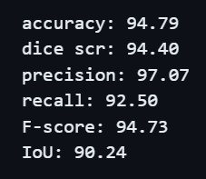

# AutoFundus

## Hardware
# 🫷🫸 Goin onnnnnnnn......

## Pipeline:

1. **Capturing High-Resolution Fundus Images:** Utilizing reinforcement learning for precise joystick movements to capture high-quality fundus images.
2. **Region of Interest Extraction:** Utilizing computer vision methods to isolate the ROI from the entire Fundus Image.
3. **Optic Disc Segmentation:** Isolating the optic disc from the cropped fundus images.
4. **Glaucoma Classification:** Differentiating between glaucoma suspects and healthy individuals.
5. **Report Generation:** Creating a comprehensive report based on the classification results.

## Results:

| Prediction | Groundtruth |
|------------|-------------|
|  |  |

### Metrics

### Not Imp info:
The `data_prep.ipynb` was run on Windows, whereas the `.py` files were executed on Linux.
